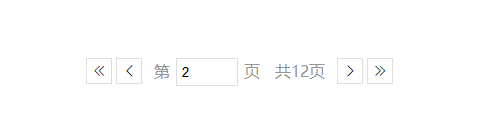

<!--
 * @Descripttion: 
 * @Author: tianxiangbing
 * @Date: 2018-11-29 15:13:24
 * @LastEditTime: 2020-03-31 15:23:45
 * @github: https://github.com/tianxiangbing
 -->
# x-paging
react分页组件x-paging，它依赖于x-input组件，主要是页码限定为正整数.
# npm
    npm install --save x-paging
# 效果图

# 使用方式
```
  callback(v) {
    console.log('当前页码：',v)
  }
  render() {
    return (
      <div>
       <Paging total="60" pagesize="5" current="1" callback={this.callback.bind(this)}/>
      </div>
    )
  }
```

# API
## total
总条数
## pagesize
每一页条数
## current
当前页码，默认为1
## callback
翻页时的回调方法
## local
国际化语言包
## pageSizeOptions :[10,20,30]
每页条数选择器，空数组时不展示,默认不展示
### 关于作者
[https://github.com/tianxiangbing](https://github.com/tianxiangbing)

### 组件github地址
[https://github.com/react-xui/x-paging](https://github.com/react-xui/x-paging)

### xui
react xui组件一直在持续更新中，欢迎大家关注[https://github.com/react-xui](https://github.com/react-xui)